# Aloja360 - Database Schema

Versión del esquema: 1.0 | Última actualización: 2026-08-15

## Diagrama ER (Mermaid)

```mermaid
erDiagram
    BUSINESS ||--o{ ACCOMMODATION : has
    BUSINESS ||--o{ GUEST : has
    BUSINESS ||--o{ SERVICE : offers
    BUSINESS ||--o{ QUOTE : generates
    BUSINESS ||--o{ RESERVATION : manages
    BUSINESS ||--o{ PAYMENT : records
    BUSINESS ||--o{ EXPENSE : incurs
    BUSINESS ||--o{ AMENITY : defines
    BUSINESS ||--o{ RATE_PERIOD : defines
    BUSINESS ||--o{ CLEANING_TASK : tracks
    BUSINESS ||--o{ MAINTENANCE_REQUEST : tracks
    BUSINESS ||--o{ INVENTORY_ITEM : owns
    BUSINESS ||--o{ EXPENSE_CATEGORY : has
    BUSINESS ||--o{ OUTBOUND_MESSAGE : sends
    BUSINESS ||--o{ AUDIT_LOG : generates
    BUSINESS ||--|{ BUSINESS_USER : ""
    USERS ||--|{ BUSINESS_USER : ""
    BUSINESS_USER }o--|| ROLES : "in business"

    ACCOMMODATION ||--o{ ACCOMMODATION_IMAGE : has
    ACCOMMODATION }o--o{ AMENITY : "via accommodation_amenity"
    ACCOMMODATION ||--o{ RATE_PERIOD : has
    ACCOMMODATION ||--o{ BLOCKED_PERIOD : has
    ACCOMMODATION ||--o{ RESERVATION : booked_in
    ACCOMMODATION ||--o{ STAY : hosts
    ACCOMMODATION ||--o{ CLEANING_TASK : requires
    ACCOMMODATION ||--o{ MAINTENANCE_REQUEST : needs
    ACCOMMODATION ||--o{ INVENTORY_ITEM : stocked_in
    ACCOMMODATION ||--o{ EXPENSE : "related to"

    GUEST ||--o{ RESERVATION : "primary in"
    GUEST ||--o{ PAYMENT : makes
    GUEST ||--o{ QUOTE : "for"
    GUEST ||--o{ OUTBOUND_MESSAGE : receives

    QUOTE ||--o| RESERVATION : converts_to
    QUOTE }o--|| ACCOMMODATION : for
    QUOTE }o--o| GUEST : for

    RESERVATION ||--|{ RESERVATION_GUEST : has
    RESERVATION_GUEST }o--o| GUEST : references
    RESERVATION ||--|{ RESERVATION_SERVICE : includes
    RESERVATION_SERVICE }o--o| SERVICE : references
    RESERVATION ||--|{ RESERVATION_STATUS_HISTORY : logs
    RESERVATION ||--o{ PAYMENT : has
    RESERVATION ||--|| STAY : creates
    RESERVATION ||--o{ CLEANING_TASK : triggers
    RESERVATION ||--o{ INVENTORY_CHECK : audited_by
    RESERVATION ||--o{ OUTBOUND_MESSAGE : about

    PAYMENT }o--o| GUEST : "from"
    STAY ||--o{ CLEANING_TASK : requires
    STAY ||--o{ INVENTORY_CHECK : audited_by

    CLEANING_TASK }o--o| STAY : "for stay"
    CLEANING_TASK ||--o{ INVENTORY_CHECK : triggers

    MAINTENANCE_REQUEST ||--o| BLOCKED_PERIOD : blocks
    MAINTENANCE_REQUEST ||--o| EXPENSE : costs

    INVENTORY_CHECK ||--|{ INVENTORY_CHECK_ITEM : contains
    INVENTORY_CHECK_ITEM }o--o| INVENTORY_ITEM : references
    INVENTORY_CHECK }o--o| CLEANING_TASK : "during"

    EXPENSE }o--o| EXPENSE_CATEGORY : categorized

    BUSINESS {
        bigint id PK
        string name
        string legal_name
        string tax_id
        string email
        string phone
        string whatsapp
        string address
        string city
        string country
        string timezone
        string currency
        string status
        json settings
        datetime created_at
        datetime updated_at
        datetime deleted_at
    }

    BUSINESS_USER {
        bigint id PK
        bigint business_id FK
        bigint user_id FK
        bigint role_id FK
        datetime created_at
        datetime updated_at
    }

    USERS {
        bigint id PK
        bigint role_id FK
        bigint current_business_id FK
        string name
        string email
        string password
        datetime email_verified_at
    }

    ROLES {
        bigint id PK
        string nombre
        string slug
        string descripcion
    }

    PERMISSIONS {
        bigint id PK
        string nombre
        string slug
        string descripcion
    }

    ACCOMMODATION {
        bigint id PK
        bigint business_id FK
        string code UK
        string name
        string type
        string status
        text description
        int max_guests
        int min_nights
        int bedrooms
        int beds
        int bathrooms
        decimal base_price
        decimal cleaning_fee
        decimal security_deposit
        string check_in_time
        string check_out_time
        datetime created_at
        datetime updated_at
        datetime deleted_at
    }

    AMENITY {
        bigint id PK
        bigint business_id FK
        string name
        string category
        string icon
    }

    ACCOMMODATION_IMAGE {
        bigint id PK
        bigint accommodation_id FK
        string path
        boolean is_primary
    }

    RATE_PERIOD {
        bigint id PK
        bigint business_id FK
        bigint accommodation_id FK
        string name
        date start_date
        date end_date
        json days_of_week
        decimal price_per_night
        string status
    }

    BLOCKED_PERIOD {
        bigint id PK
        bigint business_id FK
        bigint accommodation_id FK
        string type
        date start_date
        date end_date
        bigint maintenance_request_id FK
        boolean is_active
    }

    GUEST {
        bigint id PK
        bigint business_id FK
        string first_name
        string last_name
        string document_type
        string document_number
        string email
        string phone
        string whatsapp
        date birth_date
        string country
        string city
        decimal lifetime_value
        datetime created_at
        datetime updated_at
        datetime deleted_at
    }

    SERVICE {
        bigint id PK
        bigint business_id FK
        string name
        string category
        decimal price
        string price_type
        boolean is_active
    }

    QUOTE {
        bigint id PK
        bigint business_id FK
        string code UK
        string status
        bigint accommodation_id FK
        bigint guest_id FK
        date check_in_date
        date check_out_date
        int nights_count
        int guests_count
        decimal nightly_subtotal
        decimal services_total
        decimal total_amount
        bigint reservation_id FK
        datetime expires_at
        datetime created_at
    }

    RESERVATION {
        bigint id PK
        bigint business_id FK
        string code UK
        string status
        string source
        bigint accommodation_id FK
        bigint primary_guest_id FK
        bigint quote_id FK
        date check_in_date
        date check_out_date
        datetime actual_check_in_at
        datetime actual_check_out_at
        int guests_count
        int nights_count
        decimal nightly_subtotal
        decimal services_total
        decimal discount_total
        decimal tax_total
        decimal cleaning_fee
        decimal security_deposit
        decimal total_amount
        decimal deposit_required
        json rate_snapshot
        text cancellation_reason
        datetime cancelled_at
        datetime no_show_at
        datetime hold_until
        datetime created_at
        datetime updated_at
        datetime deleted_at
    }

    RESERVATION_GUEST {
        bigint id PK
        bigint reservation_id FK
        bigint guest_id FK
        boolean is_primary
        string first_name
        string last_name
        string document_number
    }

    RESERVATION_SERVICE {
        bigint id PK
        bigint reservation_id FK
        bigint service_id FK
        string name
        int quantity
        decimal unit_price
        decimal total
    }

    RESERVATION_STATUS_HISTORY {
        bigint id PK
        bigint reservation_id FK
        string previous_status
        string new_status
        bigint changed_by FK
        text notes
        datetime created_at
    }

    PAYMENT {
        bigint id PK
        bigint business_id FK
        string code UK
        string type
        string status
        string method
        bigint reservation_id FK
        bigint guest_id FK
        decimal amount
        string currency
        date payment_date
        datetime confirmed_at
        datetime rejected_at
        string reference
        string transaction_id
        datetime created_at
        datetime deleted_at
    }

    STAY {
        bigint id PK
        bigint business_id FK
        bigint reservation_id FK
        bigint accommodation_id FK
        bigint primary_guest_id FK
        datetime actual_check_in_at
        datetime actual_check_out_at
        decimal extra_charges_total
        decimal damages_total
        decimal security_deposit_returned
        decimal security_deposit_retained
    }

    CLEANING_TASK {
        bigint id PK
        bigint business_id FK
        bigint accommodation_id FK
        bigint reservation_id FK
        bigint stay_id FK
        string status
        string type
        datetime scheduled_at
        datetime started_at
        datetime completed_at
        bigint assigned_to FK
        int quality_score
    }

    MAINTENANCE_REQUEST {
        bigint id PK
        bigint business_id FK
        bigint accommodation_id FK
        string status
        string priority
        string title
        text description
        datetime reported_at
        datetime scheduled_at
        datetime started_at
        datetime completed_at
        bigint assigned_to FK
        decimal estimated_cost
        decimal actual_cost
        bigint blocked_period_id FK
        boolean blocks_accommodation
        datetime created_at
        datetime deleted_at
    }

    INVENTORY_ITEM {
        bigint id PK
        bigint business_id FK
        bigint accommodation_id FK
        string category
        string name
        int expected_quantity
        int current_quantity
        decimal unit_value
        decimal replacement_cost
        string condition
    }

    INVENTORY_CHECK {
        bigint id PK
        bigint business_id FK
        bigint accommodation_id FK
        bigint reservation_id FK
        bigint cleaning_task_id FK
        string check_type
        datetime performed_at
        bigint performed_by FK
        int missing_count
        int damaged_count
        decimal total_charge_amount
    }

    INVENTORY_CHECK_ITEM {
        bigint id PK
        bigint inventory_check_id FK
        bigint inventory_item_id FK
        string item_name
        int expected_quantity
        int actual_quantity
        int missing_quantity
        int damaged_quantity
        decimal charge_amount
    }

    EXPENSE_CATEGORY {
        bigint id PK
        bigint business_id FK
        string name
        string slug
        boolean is_tax_deductible
        boolean is_default
    }

    EXPENSE {
        bigint id PK
        bigint business_id FK
        bigint expense_category_id FK
        bigint accommodation_id FK
        bigint maintenance_request_id FK
        string title
        string category
        decimal amount
        decimal tax_amount
        date expense_date
        string payment_method
        boolean is_approved
        bigint approved_by FK
        datetime created_at
        datetime deleted_at
    }

    OUTBOUND_MESSAGE {
        bigint id PK
        bigint business_id FK
        string channel
        string status
        string recipient_type
        bigint recipient_id
        string recipient_identifier
        string subject
        text content
        string event_type
        bigint reservation_id FK
        bigint guest_id FK
        bigint payment_id FK
        datetime scheduled_at
        datetime sent_at
        datetime failed_at
        int retry_count
    }

    AUDIT_LOG {
        bigint id PK
        bigint business_id FK
        bigint user_id FK
        string action
        string model_type
        bigint model_id
        string ip_address
        json old_values
        json new_values
        json context
        datetime created_at
    }
```



## Reglas clave de esquema

### Tipos de datos monetarios
- **TODOS** los campos de dinero usan `DECIMAL(14, 2)`
- Nunca usar `FLOAT` o `DOUBLE` para valores monetarios
- Campos: `base_price`, `cleaning_fee`, `security_deposit`, `total_amount`, `amount`, `estimated_cost`, etc.

### Campos de estado (no usar DB ENUM)
Todos los estados son `VARCHAR` mapeados a PHP Enums en los modelos.
Estados canónicos:
| Entidad | Valores |
|---------|---------|
| `reservation.status` | pending, confirmed, checked_in, checked_out, cancelled, no_show |
| `accommodation.status` | available, reserved, occupied, pending_cleaning, cleaning, maintenance, blocked |
| `payment.status` | pending, confirmed, rejected, cancelled |
| `payment.type` | payment, refund, deposit, deposit_return |
| `cleaning_task.status` | pending, assigned, in_progress, completed, cancelled |
| `maintenance_request.status` | reported, scheduled, in_progress, completed, cancelled |
| `quote.status` | draft, sent, accepted, rejected, expired, converted |
| `outbound_message.status` | pending, scheduled, sent, failed, cancelled |

### Soft Deletes
Aplicados en: `accommodations`, `guests`, `reservations`, `payments`, `maintenance_requests`, `expenses`, `businesses`.

**Regla:** Una reserva cancelada NO se elimina con soft delete. Se cambia `status = 'cancelled'` y se llena `cancelled_at`.

### Índices importantes
| Tabla | Índice | Uso |
|-------|--------|-----|
| `reservations` | `(accommodation_id, check_in_date, check_out_date)` | Consultas disponibilidad |
| `reservations` | `(business_id, status)` | Listado por negocio |
| `guests` | `(business_id, document_number)` | Búsqueda huésped |
| `payments` | `(reservation_id, status)` | Cálculo saldo |
| `blocked_periods` | `(accommodation_id, start_date, end_date)` | Disponibilidad |
| `audit_logs` | `(model_type, model_id)` | Historial por entidad |

### Relaciones de disponibilidad
Para consultar disponibilidad real de un alojamiento en un rango:
1. Reservas que bloquean (`status` IN pending, confirmed, checked_in) con solapamiento
2. BlockedPeriods activos (`is_active = 1`) con solapamiento
3. MaintenanceRequest activos con `blocks_accommodation = 1`

**Fórmula solapamiento:**
```sql
new_check_in < existing_check_out
AND
new_check_out > existing_check_in
```

### Verdad financiera primaria
El saldo pendiente de una reserva **NO** se almacena. Se calcula:
```
reservation.total_amount
- SUM(confirmed payments where type IN [payment, deposit])
+ SUM(confirmed refunds/deposit_returns)
= outstanding_balance
```

### Precios históricos
- `reservation_services` almacena snapshot de `name`, `unit_price`, `total` al momento
- `reservations.rate_snapshot` JSON almacena snapshot de tarifas aplicadas
- Nunca se lee el precio actual de `services.price` para reportar reservas pasadas

## Migraciones (orden)
```
0001_01_01_000000  create_users_table             (LARAVEL DEFAULT)
0001_01_01_000001  create_cache_table             (LARAVEL DEFAULT)
0001_01_01_000002  create_jobs_table              (LARAVEL DEFAULT)
2026_02_07_160611  create_roles_table             (EXISTENTE)
2026_02_07_172536  create_permissions_table      (EXISTENTE)
2026_02_07_183434  add_menu_fields_to_permissions (EXISTENTE)
2026_05_05_044248  create_configuracions_table    (EXISTENTE)
--- NUEVAS (Aloja360 core) ---
2026_08_15_000001  create_businesses_table
2026_08_15_000002  create_business_user_table (+ current_business_id en users)
2026_08_15_000003  create_accommodations_table
2026_08_15_000004  create_amenities + accommodation_amenity
2026_08_15_000005  create_accommodation_images
2026_08_15_000006  create_rate_periods
2026_08_15_000007  create_blocked_periods
2026_08_15_000008  create_guests
2026_08_15_000009  create_services
2026_08_15_000010  create_quotes
2026_08_15_000011  create_reservations
2026_08_15_000012  reservation_guests + reservation_services + status_histories
2026_08_15_000013  create_payments
2026_08_15_000014  create_stays
2026_08_15_000015  create_cleaning_tasks
2026_08_15_000016  create_maintenance_requests
2026_08_15_000017  inventory_items + inventory_checks + inventory_check_items
2026_08_15_000018  expense_categories + expenses
2026_08_15_000019  create_outbound_messages
2026_08_15_000020  create_audit_logs
```

## PHP Enums (app/Enums)
- `ReservationStatus` → statuses + `blocksAvailability()`
- `AccommodationStatus` → estados operativos alojamiento
- `AccommodationType` → cabin, glamping, apartment, house, villa, room, farm, other
- `PaymentStatus` → + `affectsBalance()`
- `PaymentType` → payment/refund/deposit/deposit_return
- `PaymentMethod` → cash, bank_transfer, credit_card, nequi, daviplata, etc.
- `CleaningTaskStatus`
- `MaintenanceRequestStatus`
- `MaintenancePriority` → low/medium/high/critical
- `QuoteStatus` → + `blocksAvailability()` (siempre false)
- `BlockedPeriodType` → owner_use, maintenance, administrative, other
- `ExpenseCategory` → utilities, maintenance, payroll, cleaning, supplies, etc.
- `OutboundMessageChannel` → whatsapp/email/sms
- `OutboundMessageStatus`
- `DocumentType` → CC/CE/TI/Passport/NIT/Other

## Modelos Eloquent (app/Models)
Cada uno con relaciones, casts a Enums/decimal/date/datetime, y helpers donde aplica:
- `Business` → 15+ hasMany + BelongsToMany users
- `Accommodation` → amenities, images, ratePeriods, blockedPeriods, reservations, stays, cleaning, maintenance, inventory, expenses
- `Guest` → fullName(), reservations, stays, payments, quotes, outboundMessages (morphMany)
- `Reservation` → guests (pivot snapshot), services (snapshot), statusHistories, payments, stay, + accessor `outstanding_balance` calculado, + `blocksAvailability()` delegado a Enum
- `Payment` → `affectsBalance()` delegado a Enum
- `AuditLog` → morphTo model
- `OutboundMessage` → morphTo recipient

## Seguridad multi-empresa
- **TODAS** las entidades core tienen `business_id`
- `business_user` pivot con `role_id` por negocio
- Consultas futuras deben aplicar scope global por `business_id` activo
- `users.current_business_id` indica el negocio seleccionado en la sesión
- URL manipulation debe bloquearse en Policies (ej: `/reservations/100` debe pertenecer al business activo)
